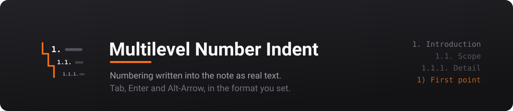
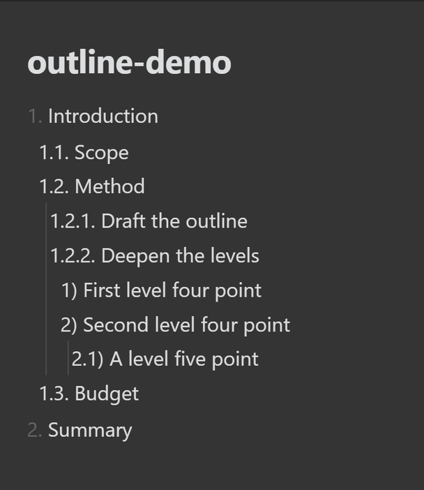
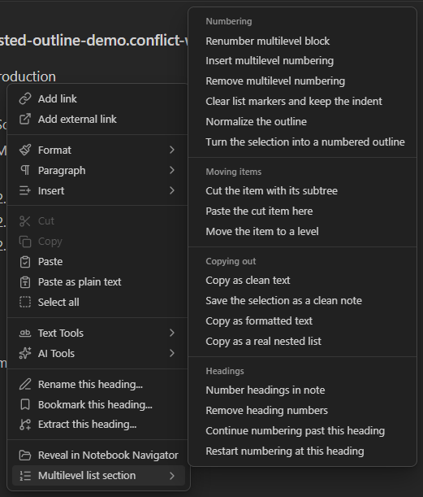
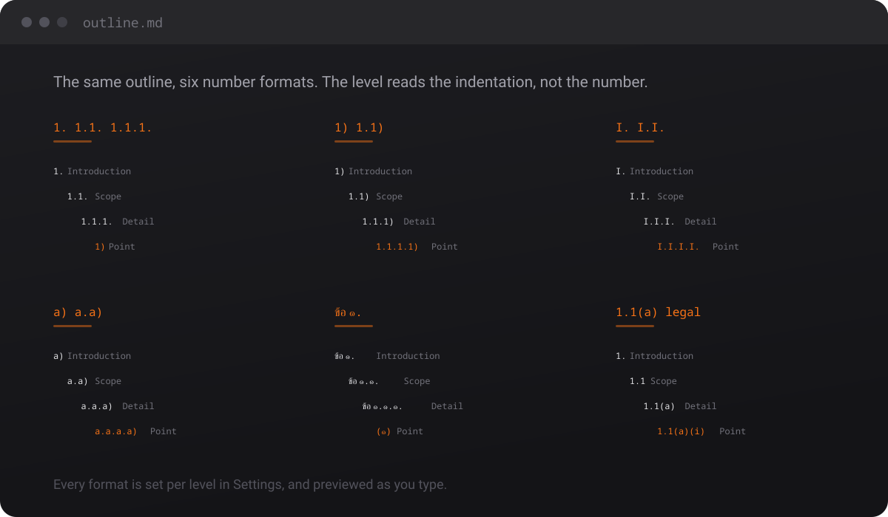
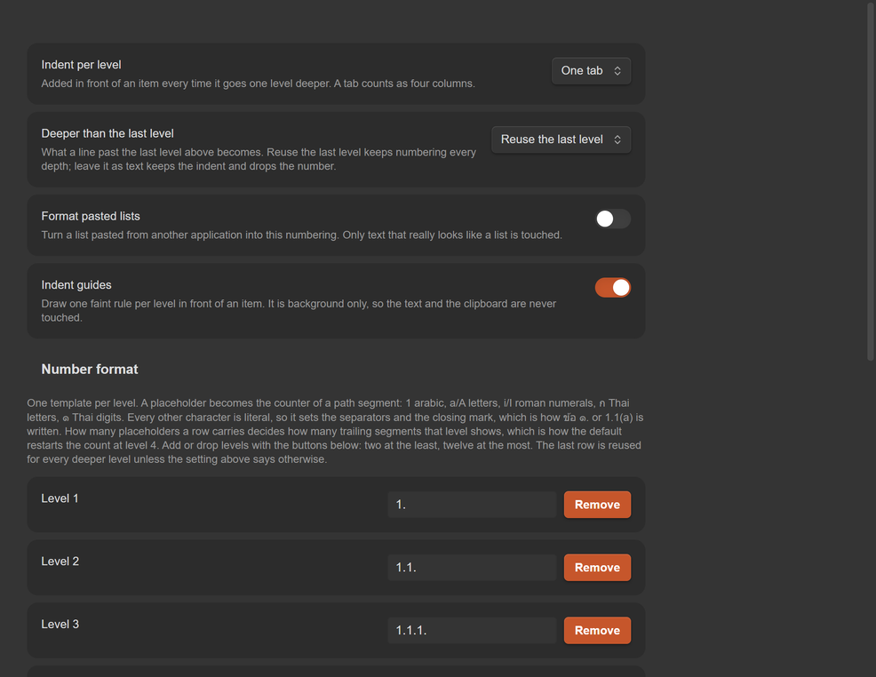
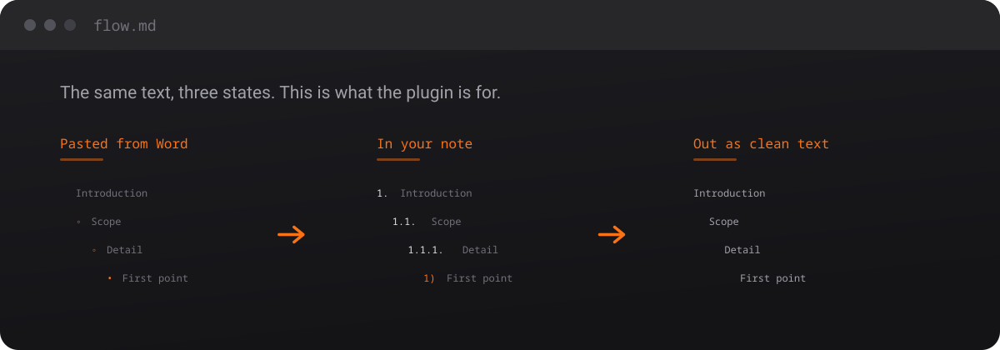

[](https://github.com/AlungranPJ/obsidian-multilevel-number-indent/releases/latest)
[](https://github.com/AlungranPJ/obsidian-multilevel-number-indent/actions/workflows/ci.yml)
[](#development)
[](LICENSE)
[](https://github.com/AlungranPJ/obsidian-multilevel-number-indent/releases)

The multilevel list you know from Word, rebuilt around the fact that a note is a text file.

Press <kbd>Tab</kbd> and the item steps one level deeper, subtree and all. The numbers are **real characters in the file**, not a stylesheet trick, so they travel with the text: into a copy, into an export, into git, into any other Markdown editor. And when the outline has to leave the note, it leaves as something you can hand to a person: clean prose, a real nested list, or rich text with the numbering exactly as you wrote it.



<details>
<summary><strong>Contents</strong></summary>

- [Why this one](#why-this-one)
- [The keys](#the-keys)
- [The right-click menu](#the-right-click-menu)
- [The number format](#the-number-format)
- [Settings](#settings)
- [Getting text out](#getting-text-out)
- [Heading numbering](#heading-numbering)
- [Commands](#commands)
- [What this plugin touches](#what-this-plugin-touches)
- [Installation](#installation)
- [Compatibility](#compatibility)
- [How it works](#how-it-works)
- [Development](#development)
- [Known limitations](#known-limitations)

</details>

## Why this one

| | |
|---|---|
| **The number format is yours** | `1.` `1.1.` `1)`, `a)`, `I.`, `ข้อ ๑.` — anything you can build from the placeholders. The preview rewrites itself while you type. |
| **As deep as the note needs** | Grow or shrink the level list from two to twelve. Past the last level you choose: keep numbering, or leave the line as body text with its indent kept. |
| **In from anywhere, out to anywhere** | Paste a list from Word or a web page and it becomes this numbering. Send it back out as clean text, rich text, or a real nested list the target app numbers itself. |
| **Moving items is a first-class thing** | <kbd>Alt</kbd>+<kbd>↑</kbd>/<kbd>↓</kbd> swaps an item with the sibling at its own level, subtree and all, and leaves the caret on the item. Select a few and they move as one group. |
| **Headings run on the same engine** | `# 1 Introduction`, `## 1.1 Scope`, `#### 1) Point`. Same templates, same rules, same renumbering. |
| **It stays in your vault** | No network calls, no telemetry, no dependencies at runtime, and no build step in the shipped file. |
| **The releases are checkable** | Every asset is byte-compared against the committed file and carries a build provenance attestation. |

<details>
<summary><strong>What's new in 3.3.0</strong>: one quiet rule per line, and a menu that scans</summary>

- **One rule per item, on its number.** The margin used to show a rule at every indent step, a fan of lines next to a deep item. Now an item with sub-items draws exactly one faint rule, measured from the editor so it sits under the last digit of its own number (`5.1.1.` hangs on the final `1`) and runs down to its last sub-item. Obsidian's own per-step guides step aside on numbered lines while this is on. Switch it off in the settings tab whenever you like.
- **The right-click menu is sorted into categories** under **Multilevel list section**: **Numbering**, **Move**, **Copy** and **Headings**. Fifteen items in one column became four short lists.
</details>

<details>
<summary><strong>What's new in 3.2.0</strong>: the clear-format move, and the pasting rules written down</summary>

- **`Clear formatting`** is the clear-format move: numbers and bullets come off the front of the lines, numbers come off the headings, and the indentation is left exactly as it was, so you can lay the text out again by hand. Any numbering style goes, `1.1 text` included. Blockquotes are content and stay put.
- **Smart placement, written down.** A pasted number carries its own depth in its segments: `1.1 text` lands at level 2 and `1.1.1 text` at level 3, whatever the indent in front of it says. That is what `Convert to numbered list` does, and it is spelled out under [Smart placement](#smart-placement).
- **A picture of the right-click menu**, with the **Multilevel list section** group open, so the menu is easy to find the first time.
</details>

<details>
<summary><strong>What's new in 3.1.0</strong>: the right-click menu, and a list that can run on across a heading</summary>

- **One labelled group in the right-click menu.** Every command sits under **Multilevel list section**, so they read as this plugin's instead of being scattered through the editor menu.
- **Restart or continue the numbering at a heading**, the way Word does it. Right-click the heading and pick **Continue numbering** to keep the count running on, or **Restart numbering** to start again at `1.`. The choice is an HTML comment on the heading line, so it never shows in reading view or in an exported copy.
- **Pasted numbers without a closing mark** (`1.1 text`, `1.1.1 text`) are taken off whole now, and the number itself says how deep the item sits, so a ragged indent cannot push an item down a level.
- **No more stray rules around a deep item.** A four-space indent makes the host read the line as an indented code block, and that block's tint and its top and bottom rules were the odd lines people were seeing in the editor.
</details>

<details>
<summary><strong>What's new in 3.0.0</strong> — the settings tab bends to the note, and the text that comes out is ready to use</summary>

- **Grow or shrink the level list** in the settings tab, and decide what a line past the last level becomes.
- **Presets**, so nobody has to build `1.1(a)` by hand. Six come with the plugin, you can save your own, and the set travels between machines as JSON.
- **Thai number styles**: `ก` for `ก` `ข` `ค`, `๑` for `๑` `๒` `๓`. `ข้อ ๑.` is written the same way `1.1(a)` is.
- **Per-note formats** in the frontmatter, so a legal note and a workshop note can live in one vault in different shapes.
- **`Tidy up list`** puts a drifted note back: whole-unit indents, the space back after `1.text`, trailing whitespace gone, every number recomputed.
- **Smart paste** turns foreign bullets and numbers into this numbering. Opt-in, and it only fires when the clipboard really looks like a list.
- **Clean text on the way out**: links become their display text, callouts keep their titles and lose their markers, comments and emphasis go.
- **Rich text on the way out**: HTML and RTF with the numbering kept, or as a real nested list so Word and mail clients number it themselves.
- **Multi-line selections move as one group**, subtrees included.
- **Cut and paste as a subtree**, and **Change list level**, for the moves that are about structure rather than one keystroke.
- **Indent guides** and a **status bar** that names the level and the number under the cursor.

Also fixed: blank lines between two siblings no longer disappear when <kbd>Alt</kbd>+<kbd>↑</kbd>/<kbd>↓</kbd> swaps them, and body text written deeper than an item no longer restarts the count. [Full changelog](CHANGELOG.md)

</details>

## The keys

| Key | On a numbered line | On a heading line |
|---|---|---|
| <kbd>Tab</kbd> | Indent the item and its whole subtree | Increase the heading level, then renumber |
| <kbd>Shift</kbd>+<kbd>Tab</kbd> | Outdent the item and its subtree | Decrease the heading level, then renumber |
| <kbd>Enter</kbd> | Start the next sibling at the same depth | Left to Obsidian |
| <kbd>Alt</kbd>+<kbd>↑</kbd> / <kbd>↓</kbd> | Swap with the adjacent sibling **at the same level** | Swap the whole section with the adjacent heading of the same level |

A selection that spans several lines moves as one group. Drag over four sibling items and press <kbd>Tab</kbd>: all four step in one level, side by side, each keeping its own subtree, and they stay selected. The same goes for <kbd>Shift</kbd>+<kbd>Tab</kbd> and <kbd>Alt</kbd>+<kbd>↑</kbd>/<kbd>↓</kbd>: the selection rides along with the group until you click somewhere else, so you can keep pressing keys to walk it into place. A key that has nowhere to go (a group already at the top, or with no sibling to nest under) leaves the group where it is, still selected.

Every key is scoped to lines this plugin recognises. Everywhere else nothing happens: <kbd>Tab</kbd> keeps Obsidian's normal indent behaviour, <kbd>Enter</kbd> keeps working in tables, code blocks and prose, and <kbd>Alt</kbd>+<kbd>↑</kbd>/<kbd>↓</kbd> never changes depth. The caret follows the item to wherever it lands.

## The right-click menu

Right-click anywhere in the editor and look for **Multilevel list section** near the bottom. Hover it and one panel opens with everything this plugin can do, sorted under four small grey headings. The headings are only labels, so you can slide the mouse straight from **Numbering** down to **Headings** without anything closing on you.



A rule of thumb before the details: **select first, then right-click.** Most commands work on the lines you selected. With nothing selected they work on the line under the cursor (or on the whole note, where that is what makes sense, and the table says so). Every command is one step of undo, so <kbd>Ctrl</kbd>+<kbd>Z</kbd> always puts things back if the result is not what you pictured.

### Numbering

| Menu item | Use it when | What happens |
|---|---|---|
| **Reset numbering** | The numbers went out of step after hand edits: `1.5.` under `1.`, two items both called `3.` | Every number in the block is counted again from the real indentation. The words are not touched. The cursor can sit anywhere in the list. |
| **Add numbering** | You wrote plain lines and indented them with <kbd>Tab</kbd>, and now you want numbers | Select the lines. Each one gets the number its indent calls for: `Goals` / `→ speed` becomes `1. Goals` / `→ 1.1. speed`. For bullets or someone else's numbers use **Convert to numbered list** instead, it strips the old marker first. |
| **Remove numbering** | You want this plugin's numbers gone and nothing else changed | The `1.` / `1.1.` / `1)` come off. Bullets, headings and indentation stay exactly as they are. |
| **Clear formatting** | You want a clean slate: every kind of marker gone | Numbers of any style, bullets (`-` `*` `•`), and heading numbers all come off. The indentation stays, so the shape of the list survives and you can number it again in one click. |
| **Tidy up list** | A list looks ragged: three spaces here, five there, `1.text` with no space | Indents snap to whole levels, the space after the number comes back, trailing spaces go, and everything is renumbered. |
| **Convert to numbered list** | You pasted a list from Word, a web page or a chat | Select the pasted lines. Old bullets and numbers are replaced with this plugin's numbering, and a dotted number decides its own level: `1.1 Scope` lands at level 2, `1.1.1 In scope` at level 3, whatever the indent says. See [Smart placement](#smart-placement). |

### Move

| Menu item | Use it when | What happens |
|---|---|---|
| **Cut item** | An item and everything under it belongs somewhere far away, too far for <kbd>Alt</kbd>+<kbd>↑</kbd>/<kbd>↓</kbd> | Put the cursor on the item and pick it. The item and all its sub-items leave the note and wait in the plugin's own pocket (your normal clipboard is left alone). The list closes up and renumbers. |
| **Paste item** | Right after a cut | Put the cursor on the item you want it to follow. The whole branch lands right after that item, at the same level, and everything renumbers. With nothing cut, it does nothing. |
| **Change list level** | You know the level you want: "this should be level 2" | A small box asks for a level number. The item and its sub-items jump there in one go, instead of pressing <kbd>Tab</kbd> or <kbd>Shift</kbd>+<kbd>Tab</kbd> several times. |

### Copy

These four work on the selection, or on the whole note when nothing is selected. None of them changes the note.

| Menu item | Use it when | What happens |
|---|---|---|
| **Copy as plain text** | Pasting into a chat, an email, a form: somewhere Markdown would look like noise | The text goes to the clipboard with the numbers kept and the Markdown gone: `[[Note\|shown]]` becomes `shown`, `**bold**` becomes `bold`, `%%comments%%` disappear. |
| **Save as plain text note** | You want that clean version as a file of its own | The same clean text, saved as a new note named after this one, `(clean)` on the end. |
| **Copy with formatting** | Pasting into Word, Google Docs or an email and you want it to look like the note | Rich text with the numbering exactly as you see it, indents included. |
| **Copy as nested list** | The other document should own the numbering, so it can keep renumbering as people edit | A real nested list: Word or the mail app numbers it with its own list style. |

### Headings

| Menu item | Use it when | What happens |
|---|---|---|
| **Number headings** | You want a numbered document structure | Every heading in the note gets a number: `# 1 Intro`, `## 1.1 Scope`, `# 2 Method`. From then on, changing a heading level with <kbd>Tab</kbd> renumbers them automatically. |
| **Remove heading numbers** | The report is done, or you changed your mind | The numbers come off every heading, and the automatic renumbering stops. |
| **Continue numbering** | A list above a heading should keep counting below it (`4.` `5.`) instead of starting again at `1.` | Only shows when you right-click a heading. A tiny invisible mark goes on the heading line. It never shows in reading view or in a clean copy. |
| **Restart numbering** | You want the normal fresh `1.` back under that heading | Only shows on a heading. It takes that mark away again. |

### Pasting a list that already has numbers

Two ways, pick whichever suits you:

- **Automatic.** Switch on **Format pasted lists** in the settings tab. From then on <kbd>Ctrl</kbd>+<kbd>V</kbd> of anything that looks like a list (at least two numbered or bulleted lines, or lines at different indents) is laid out as this plugin's numbering straight away. Plain paragraphs are pasted as they are. The switch ships off, so turn it on the first time.
- **By hand.** Paste as usual, select the pasted lines, right-click, **Multilevel list section**, **Convert to numbered list**.

Either way you do **not** need to clear the old numbers first. The old markers are replaced for you, and a dotted number such as `1.1` or `1.1.1` even tells the plugin which level it belongs on. Reach for **Clear formatting** first only when you want to throw the old structure away and arrange the lines yourself.

One thing the plugin cannot guess: a line with no dotted number is placed by its indent. So `a) speed` sitting flush under `1) Goals` with no indent comes out as a sibling, not a child. Select those lines and press <kbd>Tab</kbd> once, and they step in together.

## The number format

Out of the box it looks like this:

```text
1. Introduction
  1.1. Scope
    1.1.1. Detail
      1) First point
        1.1) Detail of the first point
      2) Second point
2. Summary
```

Levels 1 to 3 show the full path and end with a period: `1.` `1.1.` `1.1.1.` Level 4 and deeper restart the count and end with a bracket: `1)` `1.1)`. Each level adds two spaces of indent, so the text always starts four columns further right and lines up on a plain grid.

The level comes from the indentation, never from the number. That is why <kbd>Tab</kbd> rewrites the number instead of only moving the line: `1.1.1.` becomes `1)` at level 4, and `1)` becomes `1.1.2.` when it moves back up. The caret stays in the text, never in the middle of a number.

`1.1.` is deliberately not a Markdown list marker. That is the whole trick: the numbers are plain text, so they travel with the note. A root `1.` is the one exception, and `styles.css` undoes Obsidian's list indent on the recognised lines so every level stays on the same grid.



### Placeholders

| Placeholder | Renders |
|---|---|
| `1` | `1` `2` `3` … |
| `a` / `A` | `a` `b` … / `A` `B` … |
| `i` / `I` | `i` `ii` `iii` … / `I` `II` `III` … |
| `ก` | `ก` `ข` `ค` … |
| `๑` | `๑` `๒` `๓` … |

Everything else in a template is a plain character you typed, so the separators and the closing mark are yours. What the placeholders decide is how much of the path a level shows: one placeholder means one segment, three mean the full path. That is why the shipped defaults restart the count at level 4, where the row is `1)`.

```text
1.1.1.     ->  1.1.1.         full path, closed with a period
1)         ->  1)             one segment, so the count restarts
1.1)       ->  1.1)           two segments
a)         ->  a) b) c)       letters
I.         ->  I. II. III.    roman numerals
ข้อ ๑.     ->  ข้อ ๑.          a literal prefix
1.1(a)     ->  1.1(a)         legal style
```

A row with no placeholder is ignored, and that level keeps the value it had. Changing the format later is safe: numbers in the old shape are still recognised, and the next <kbd>Tab</kbd> rewrites them into the new one.

### Levels, and what comes after them

Every row in the level list has **Add level** and **Remove**. What happens past the last level is a separate setting, **Deeper than the last level**:

- **Reuse the last level** keeps numbering at every depth, however deep the note goes. This is the shipped setting.
- **Leave it as text** keeps the indent and drops the number. Use it for notes that belong to an item rather than being part of the outline: <kbd>Tab</kbd> then stops at the last level instead of pushing those notes out of the outline.

### Per-note formats

Any note can carry its own numbering in its frontmatter. The global settings come back on the next note automatically, so there is nothing to undo.

```yaml
---
numbering:
  indent: "\t"
  depth-policy: unnumbered
  formats:
    - "1."
    - "1.1."
---
```

`formats` also fits on one line: `formats: ["a.", "a.a."]`. A value that is not a valid template is ignored instead of being half applied.

### Presets

A preset is a whole level list saved under a name. Six come with the plugin: dotted then brackets, full path dots, letters, roman numerals, legal style and Thai. **Apply a preset** replaces the level list, **Save the current list** saves what you built, and saving under a name that already exists replaces the old one.

**Preset JSON** is how the saved ones travel: **Export** copies them to the clipboard for another machine, **Import** reads the box and replaces the saved list. Anything that is not a clean list of presets is refused rather than half imported.

## Settings

Everything lives in one tab, **Settings → Multilevel Number Indent**.



| Section | What is in it |
|---|---|
| **Indent per level** | Two spaces, four spaces, or one tab |
| **Deeper than the last level** | Reuse the last level, or leave the line as text |
| **Format pasted lists** | Converts pasted lists on <kbd>Ctrl</kbd>+<kbd>V</kbd>. Ships switched off |
| **Indent guides** | One faint rule per item with sub-items, under the last digit of its number and down to its last sub-item. When a long number such as `1.1.1)` reaches past where its sub-items' text starts, the rule slides left to sit just before that text, so it never cuts through a letter. Obsidian's own guides step aside on numbered lines while it is on |
| **Number format** | One template per level, with **Add level** and **Remove**, and a live preview |
| **Presets** | Six built in, save your own, and **Preset JSON** to move the set between machines |

## Getting text out

The numbering is only half the job. What matters is the text that comes out.



| Command | What it does |
|---|---|
| `Tidy up list` | Puts a drifted note back into shape and renumbers it from the real depth |
| `Convert to numbered list` | Takes a pasted list apart and rebuilds it in this numbering, foreign bullets and foreign numbers included |
| `Copy as plain text` | The selection as prose: links become their display text, callout markers and comments and emphasis go |
| `Save as plain text note` | The same cleaned text, written to a new note |
| `Copy with formatting` | HTML and RTF with the numbering kept exactly as it reads in the note |
| `Copy as nested list` | HTML and RTF as a real nested list, so Word and mail clients number it themselves |

**Format pasted lists** in the settings tab does that first conversion automatically on <kbd>Ctrl</kbd>+<kbd>V</kbd>. It ships switched off, and it only fires on text that really looks like a list.

### Smart placement

When a list comes in from Word, a web page or a chat, the numbers usually know more than the indents do. So the number says how deep the item goes: `1.1 text` is level 2 and `1.1.1 text` is level 3, whatever indentation sits in front of it. Only a dotted number gets that say (`1.1`, `1.1.1`, `1.1.1)`); a line that merely starts with `1` is prose and is placed by its indent like everything else. A drifted indent therefore cannot push an item down a level, and a ragged outline comes out level.

It is the same move through either door: `Convert to numbered list` on a selection, or <kbd>Ctrl</kbd>+<kbd>V</kbd> with **Format pasted lists** switched on. Right-click the text and it is in the menu too, under **Multilevel list section**. That is the whole thing: select the lines, right-click, pick the command, and the list lays itself out.

The smallest indent step in the text decides what one level is worth, so a three-space or a tab outline still comes out one level per step. And the numbers are counted, never copied: `1.2.4` written under `1.2.1` comes out `1.2.2`, because the count always follows the real depth.

## Heading numbering

Headings use the same templates with the closing period dropped: `# 1 Introduction`, `## 1.1 Scope`, `### 1.1.1 Detail`. From level 4 they follow the plain-text rule and end with a bracket: `#### 1) Point`, `##### 1.1) Detail`.

Changing a heading level or moving a section renumbers the note automatically, but only **once the note is in numbered mode**, that is, once at least one heading carries a number. A note with no numbers is left alone, so <kbd>Tab</kbd> never starts numbering a document by surprise. `Number headings` turns the mode on, `Remove heading numbers` turns it off.

A heading normally starts a fresh list: the items under it count from `1.` again. When you want the count to run on instead, the way Word lets a list continue across a heading, right-click the heading and pick **Continue numbering**. **Restart numbering** puts it back. The choice rides on the heading line as an HTML comment, so reading view and `Copy as plain text` never show it.

## Commands

| Command | What it does |
|---|---|
| `Number headings` | Write `1` / `1.1` / `1.1.1` into every heading |
| `Remove heading numbers` | Strip the numbers from every heading |
| `Reset numbering` | Recompute the plain-text numbers from the real indentation |
| `Add numbering` | Turn a space-indented outline into a numbered one |
| `Remove numbering` | Strip the plain-text numbers, keeping the indentation |
| `Clear formatting` | The clear-format move: numbers and bullets of any style off the lines, numbers off the headings too, the indentation left exactly as it was |
| `Tidy up list` | Put a drifted outline back into shape and renumber it |
| `Convert to numbered list` | Convert pasted bullets and foreign numbers |
| `Cut item` | Take an item and everything under it out, ready to place |
| `Paste item` | Put it back after the current item, at that item's level |
| `Change list level` | Ask for a level and move the item and its subtree there |
| `Continue numbering` | Let the list run on across the heading instead of starting again at `1.` |
| `Restart numbering` | Start a fresh count at `1.` under this heading |
| `Copy as plain text` | The selection as prose, without any Markdown markers |
| `Save as plain text note` | The same, written to a new note |
| `Copy with formatting` | Rich text with the numbering kept |
| `Copy as nested list` | Rich text as a nested list the target numbers itself |

Each command is one editor transaction, so a single <kbd>Ctrl</kbd>+<kbd>Z</kbd> puts everything back.

Every command is also in the right-click menu, and the [right-click menu](#the-right-click-menu) section walks through each one.

## What this plugin touches

No network calls, no telemetry, and nothing loaded at runtime beyond what the host already provides. Two things are worth spelling out anyway.

- **The clipboard, and only when you ask for it.** `Copy as plain text`, `Copy with formatting` and `Copy as nested list` write to it. `Format pasted lists` reads what you just pasted, through the paste event itself. Nothing is read or written in the background.
- **Obsidian's own list help stays out of the plugin's way.** With **Smart lists** on, Obsidian renumbers a line you just nested so it continues the nearest earlier list. The plugin writes its edits with that pass switched off, and while you type it puts back any number Smart lists rewrote on the line you are in, so a new sub-list starts at `1)` and stays there instead of carrying on from an old one. A number you retype by hand is yours; **Reset numbering** tidies the list afterwards.
- **Your notes, through the normal vault API.** Every command is one editor transaction, so one <kbd>Ctrl</kbd>+<kbd>Z</kbd> puts everything back. No file is touched outside the note you are in, except `Save as plain text note`, which creates one new note that you named.

## Installation

**From the community directory:** **Settings → Community plugins → Browse → Multilevel Number Indent**.

**Manually:** copy `main.js`, `manifest.json` and `styles.css` into `<vault>/.obsidian/plugins/nested-outline-numbering/`, then enable the plugin in **Settings → Community plugins**.

## Compatibility

Other plugins that bind <kbd>Tab</kbd> in the editor (Obsidian Outliner, say) are not a problem. This one listens on the capture phase of `keydown` and only stops the event when it actually changed the text, so Outliner keeps indenting its lists while this plugin looks after the numbered lines.

What you should not do is run two plugins claiming the same keys on the same kind of line. If you are migrating from a similar plugin, turn it off first.

## How it works

`main.js` is one hand-written CommonJS file. No build step, no dependencies at runtime, and nothing beyond `obsidian` and `@codemirror/*`, both of which the host provides.

It is split in two, on purpose:

- **CORE** is pure text transformations (`indentItem`, `outdentItem`, `newSibling`, `moveItem`, `normalizeOutline`, `ingestOutline`, `cleanForExport`, `buildHtmlOutline`, `cutItem`, `pasteItem`, `setLevel`, `shiftHeadingLevel`, `moveHeading`, `numberHeadings`, …). It never touches the Obsidian API, which is the whole reason it can be tested outside the app.
- **PLUGIN** is the `Plugin` subclass that wires the keys and the commands onto that core and applies each result as one minimal editor transaction.

## Development

```bash
npm ci
npm run build   # checks the files a release ships
npm test        # runs the assertions
```

The test file stubs `require("obsidian")` and `require("@codemirror/*")` so `main.js` loads in plain Node, then runs 336 assertions over the core: numbering, subtree moves, caret placement, code-fence handling, heading counters, the number templates and their round-trips, the Thai number styles, the level and depth policy settings, presets and their JSON, per-note frontmatter, normalize, smart paste, clean text, the HTML and RTF output, multi-line moves, cut and paste as a subtree, the right-click menu, the indent guides and the status bar.

On top of that it builds the settings tab against small doubles for `Setting`, `PluginSettingTab`, `Modal` and the container element, and checks the rows, the buttons, the preview and the validation. The first block of the suite checks the shape Obsidian's loader needs (`module.exports`, `.default`, `prototype.onload`), so a broken export cannot slip through.

There is no compilation step, so `npm run build` does not produce anything: it checks that the three release files are ready to ship as committed. `main.js` parses and loads as a plugin class, `manifest.json` has every field and agrees with `package.json` on the version, and `styles.css` is there. It needs no dependencies and finishes in a second, so a build-verification service can run it anywhere and compare the release assets straight against the committed files. `npm test` runs the assertions above, and CI runs both on every push.

## Known limitations

These are the edges I know about. They are stated here rather than hidden.

- Inside a template the letters `1` `a` `A` `i` `I` `ก` `๑` are placeholders, so a literal word that contains one of them renders as a counter. Build prefixes out of other letters, or write them like `ข้อ ๑.`, where only the Thai numeral is a placeholder and `ข้อ ` is literal.
- `formats` in the frontmatter reads a block list, or a flow list written on one line.
- A plain-text item can only be indented when an earlier item at that level exists for it to become a child of. This is the same rule Word follows.
- Skipped heading levels get filled in with `1`, so `#` followed by `###` numbers as `1` then `1.1.1`.
- The rich clipboard writes `text/plain`, `text/html` and `text/rtf`. An application that reads none of them still gets the plain text, with the numbering kept.

## License

[MIT](LICENSE)
